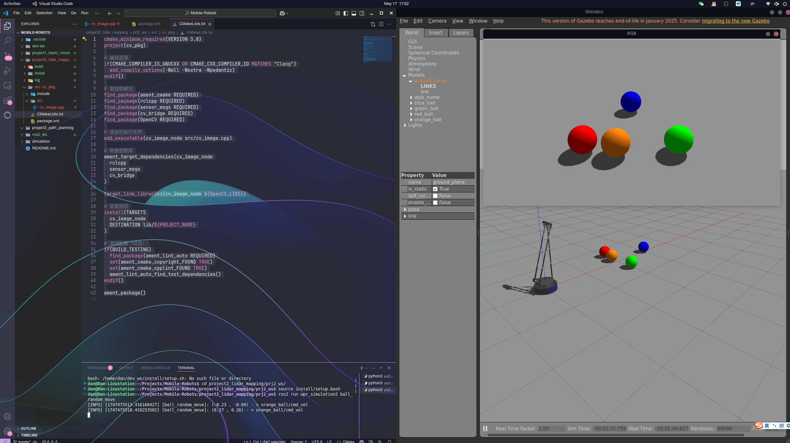
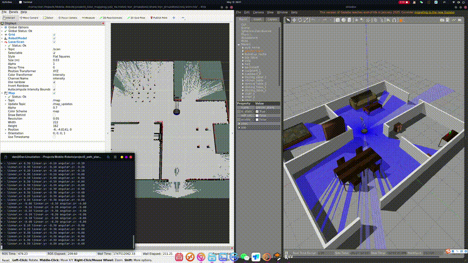
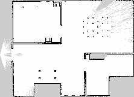
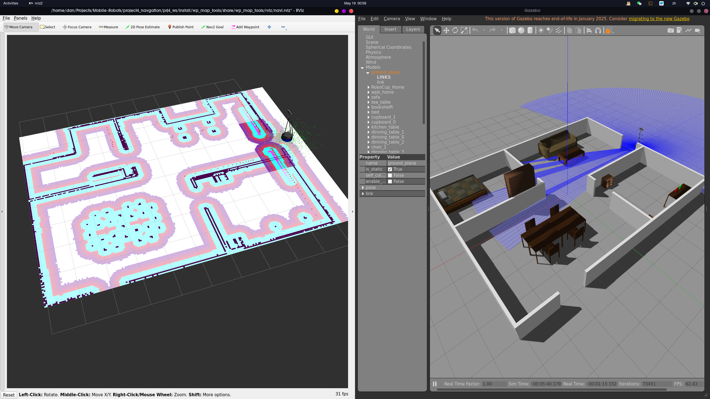

# 🎯 CQU 移动机器人课程作业仓库

本仓库包含重庆大学移动机器人课程的三个ROS2项目实践，涵盖机器人运动控制、视觉处理、SLAM建图等内容。所有项目均基于 ROS2 与 Gazebo 进行开发与仿真，适用于 Ubuntu 22.04 + ROS2 Humble 环境。

This repository contains three ROS2 project assignments from the Mobile Robots course at Chongqing University, covering topics such as robot motion control, visual processing, and SLAM mapping. All projects are developed and simulated using ROS2 and Gazebo, and are compatible with Ubuntu 22.04 + ROS2 Humble.

---

## 📂 仓库结构

```
CQU_mobile_robot_course/
├── project1_basic_move/      # 作业一：机器人底盘运动控制
│   ├── ros2_ws/
│   └── src/vel_pkg/
├── project2_lidar_mapping/   # 作业二：视觉 OpenCV
│   ├──  prj2_ws/
│   └── src/{cv_pkg, pc_pkg}
├── project3_path_planning/   # 作业三：SLAM建图 + 多源感知
│   ├── prj3_ws/
│   └── src/{imu_pkg, lidar_pkg, slam_pkg}
├── project4_navgation/       # 作业四：自动导航
│   ├── prj4_ws/
│   └── src/{imu_pkg, lidar_pkg, slam_pkg}
└── README.md

```

---

## 🚀 快速开始

### 系统要求
- Ubuntu 22.04
- ROS2 Humble
- Gazebo Fortress

```bash
# 克隆仓库
git clone --recurse-submodules https://github.com/MrDynimate/CQU_mobile_robot_course.git
cd CQU_mobile_robot_course

# 构建作业3（example）
cd project3_path_planning/prj3_ws
colcon build
source install/setup.bash

# 启动Gazebo仿真
ros2 launch wpr_simulation2 robocup_home.launch.py

# 启动SLAM建图（新终端）
ros2 launch slam_pkg slam_launch.py

# 启动导航（新终端）
ros2 launch navigation_pkg navigation.launch.py
```

---
## 🧪 作业一：机器人底盘运动控制

- **功能**：控制差速机器人在仿真环境中移动。
- **包**：`vel_pkg`
- **主要文件**：
  - `vel_node.cpp`：发布控制指令
  - `CMakeLists.txt`, `package.xml`

### ✅ 使用方法

```bash
cd project1_basic_move/ros2_ws
colcon build
source install/setup.bash
# 运行节点请根据 vel_node.cpp 内容手动 ros2 run
```

### 🌈 成果展示

展示机器人在地图上以0.1米/秒的速度向柜子靠近


---

## 👁 作业二：视觉处理与点云识别

- **功能**：使用 OpenCV 和激光雷达点云进行图像处理、人脸识别、目标跟踪等。
- **包**：
  - `cv_pkg`:图像处理（cv_face_detect.cpp, cv_hsv.cpp, cv_follow.cpp, cv_image.cpp）
  - `pc_pkg`:点云处理（pc_objects.cpp, pc_data.cpp）

### ✅ 使用方法

```bash
cd project2_lidar_mapping/prj2_ws
colcon build
source install/setup.bash

# 启动仿真环境
# 第一个终端
ros2 launch wpr_simulation2 wpb_table.launch.py

# 第二个终端（点云识别）
ros2 run pc_pkg pc_objects
```

### 🌈 成果展示

展示机器人视角所见


---

## 🗺️ 作业三：SLAM建图与多传感器融合

- **功能**：实现建图、IMU与雷达数据融合。
- **包**：
  - `imu_pkg`:IMU数据处理
  - `lidar_pkg`:雷达数据处理
  - `slam_pkg`:启动 SLAM 模块（含 slam.launch.py）

### ✅ 使用方法

```bash
cd project3_path_planning/prj3_ws
colcon build
source install/setup.bash

# 第一个终端：启动仿真环境
ros2 launch wpr_simulation2 robocup_home.launch.py

# 第二个终端：启动SLAM建图
ros2 launch slam_pkg slam.launch.py

# 第三个终端：手动控制
ros2 run wpr_simulation2 keyboard_vel_cmd
```

### 🌈 成果展示

通过遥控节点控制机器人使用雷达对房间进行建模


将建模好的地图进行导出


---

## ✈️ 作业四：基于SLAM地图的导航实现

- **功能**：实现航点路径导航与自主路径规划
- **包**：
  - `imu_pkg`:IMU数据处理
  - `lidar_pkg`:雷达数据处理
  - `slam_pkg`:启动 SLAM 模块（含 slam.launch.py）
  - `nav_pkg`:启动navigation模块

### ✅ 使用方法

```bash
cd project4_navgation/prj4_ws
colcon build
source install/setup.bash

# 第一个终端：启动仿真环境
ros2 launch wpr_simulation2 robocup_home.launch.py

# 第二个终端：启动SLAM建图
ros2 launch nav_pkg waypoint_nav.launch.py

# 第三个终端：手动控制
ros2 run nav_pkg waypoint_navigation
```

RViz2中需要通过“2D Pose Estimate”对机器人位置进行初始化，使用Nav2 Goal设置目标点

### 🌈 成果展示

左侧展示雷达感知及地图融合，右侧为gazebo仿真视角


将作业三中建模获得的地图导入，实现初始位置到目标点的自主路径规划


---
## ⚙️ 环境要求

- **操作系统**：Ubuntu 22.04 LTS
- **ROS版本**：ROS 2 Humble Hawksbill
- **开发工具**：
  - Python 3.10+
  - Gazebo 11（建议使用 `ros-humble-gazebo-ros-pkgs` 提供的版本）
  - colcon 构建工具

### 🚀 安装依赖

请参考 OriginBot 提供的安装教程，按照步骤在 Ubuntu 22.04 上配置 ROS 2 Humble 环境：

👉 [ROS 2 安装教程（OriginBot）](http://originbot.org/guide/pc_config.html)

安装完成后，建议将 ROS 环境变量添加到 `~/.bashrc` 文件中，以便每次终端启动时自动加载：

```bash
echo "source /opt/ros/humble/setup.bash" >> ~/.bashrc
source ~/.bashrc
```

---
## 🧑‍💻 开发者
- **名字**：Danny Lee (LYD)
- **学号**：20213041
- **邮箱**：20213041@cqu.edu.cn
- **课程指导老师**：Teacher Lei·Zhang

## 📝 声明

本项目仅用于课程教学与学习目的，禁止擅自转载或用于商业用途。

---

## 📄 License

This project is licensed under the terms of the MIT License. See the [LICENSE](./LICENSE) file for details.
